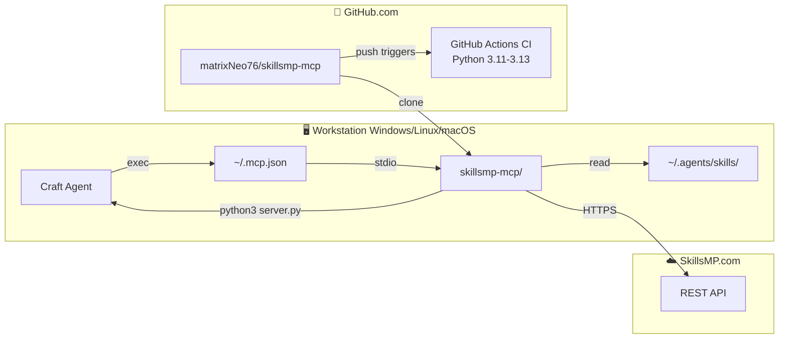

# Architettura skillsmp-mcp — Diagramma e Spiegazione

> **Progetto:** MCP server per cercare, confrontare e verificare skill AI su SkillsMP.com
> **Versione:** v1.4.1 | **Tools:** 11 MCP | **Test:** 27 | **Skill:** 583

---

## Diagramma Architetturale

```mermaid
flowchart TB
    subgraph User["👤 User"]
        U[Developer / AI Agent]
    end

    subgraph Craft["🛠️ Craft Agent"]
        SK[skillsmp-checker<br/>SKILL.md triggers]
        MCP[/skillsmp MCP Source<br/>via .mcp.json]
    end

    subgraph Server["📡 MCP Server (server.py) — 11 tools"]
        direction LR
        T1[skillsmp_search]
        T2[skillsmp_ai_search]
        T3[skillsmp_check_skill]
        T4[skillsmp_compare_skills]
        T5[skillsmp_scan_domain]
        T6[skillsmp_refresh_structure]
        T7[skillsmp_status]
        T8[skillsmp_skill_diff]
        T9[skillsmp_check_outdated]
        T10[skillsmp_discover]
        T11[skillsmp_install_skill]
    end

    subgraph Core["⚙️ Core Services"]
        Rate[RateLimitTracker<br/>500 req/day tracked]
        PCache[PersistentCache<br/>data/cache_skillsmp.json]
        Retry[Retry 3x<br/>Exponential Backoff]
        DotEnv[.env support<br/>python-dotenv]
    end

    subgraph Storage["💾 Persistence"]
        SJSON[skill_structure.json<br/>583 skill, 17 domini]
        XLSX[docs/skill_inventory.xlsx]
        CSV[docs/skill_inventory.csv]
        PCacheFile[data/cache_skillsmp.json<br/>22 cache entries]
    end

    subgraph SkillsMP["☁️ SkillsMP.com API"]
        REST[REST API<br/>skillsmp.com/api/v1]
        Search[/skills/search<br/>Keyword + filters]
        AISearch[/skills/ai-search<br/>Cloudflare AI]
        Health[/health<br/>Health check]
    end

    subgraph Local["💻 Local Filesystem"]
        SKDIR[~/.agents/skills/<br/>583 SKILL.md files]
        MCPJSON[~/.mcp.json<br/>Global MCP config]
        CONFIG[skillsmp-config.json<br/>Optional settings]
    end

    U -->|"1. 'questa skill e aggiornata?'"| SK
    SK -->|"2. trigger"| MCP
    MCP -->|"3. stdio transport"| Server
    
    Server -->|"4. API call"| Core
    Core -->|"5. HTTPS GET"| SkillsMP
    
    Server -->|"read/write"| SJSON
    Server -->|"read descriptions"| SKDIR
    Server -->|"generate"| XLSX
    Server -->|"generate"| CSV
    
    SKDIR -->|"refresh_structure.py --merge"| SJSON
    MCPJSON -->|"auto-discover"| MCP
    
    SkillsMP -.->|"response"| Core
    Core -.->|"cache + return"| Server
    Server -.->|"result"| U
```

---

## Flusso di Esecuzione

### Scenario Tipico: "Questa skill e' aggiornata?"

```
1. User: "skillsmp_check_skill('stripe-integration')"
    │
2. Craft Agent riceve la richiesta
    │
3. skillsmp-checker SKILL.md matcha il trigger
    │
4. skillsmp MCP Source (via ~/.mcp.json) avvia:
    python3 server.py skillsmp_check_skill
    │
5. server.py:
    ├── 5a. Controlla cache in-memory (veloce)
    ├── 5b. Controlla cache persistente (cache_skillsmp.json)
    └── 5c. Se non in cache: chiamata HTTPS a SkillsMP.com
         ├── GET /api/v1/skills/search?q=stripe+integration&sortBy=stars
         ├── RateLimitTracker registra la chiamata
         └── Risultato salvato in cache (TTL 300-600s)
    │
6. Risultato formattato e restituito:
    "stripe-integration: ⭐ 35521 stars, by sickn33, updated 2026-04-14"
```

---

## Struttura del Progetto

```
skillsmp-mcp/                     # Repository root
├── server.py                     # MCP Server (11 tools, ~1340 righe)
├── server/
│   └── utils.py                  # Utility functions (preparato per refactoring)
├── VERSION                       # Versione corrente (1.4.1)
├── setup.sh                      # Installer Linux/macOS
├── setup.ps1                     # Installer Windows PowerShell
├── pyproject.toml                # Dipendenze Python
│
├── data/
│   ├── skill_structure.json      # 583 skill in 17 domini (auto-generato)
│   └── cache_skillsmp.json       # Cache persistente API
│
├── docs/
│   ├── skill_inventory.xlsx      # Inventario XLSX
│   ├── skill_inventory.csv       # Inventario CSV
│   ├── mcp.example.json          # Esempio .mcp.json
│   ├── guide.md                  # Guida al source
│   └── skillsmp-quickref.md      # Comandi rapidi
│
├── scripts/
│   ├── refresh_structure.py      # Scan .agents/skills/ -> JSON
│   ├── generate_xlsx.py          # XLSX/CSV generator
│   ├── show_all_skills.py        # Bulk verification
│   └── install-hooks.ps1         # Pre-commit hook
│
├── skills/
│   └── skillsmp-checker/
│       └── SKILL.md              # Craft Agent skill
│
├── tests/
│   └── test_server.py            # 27 test pytest
│
├── .github/workflows/
│   └── test.yml                  # GitHub Actions CI
│
├── skillsmp-config.json          # Config opzionale
├── .mcp.json                     # MCP registration (copia in ~/)
│
├── README.md                     # Documentazione principale
├── ARCHITECTURE.md               # Architettura dettagliata
├── AGENTS.md                     # Istruzioni per AI agent
├── CHANGELOG.md                  # Storico versioni
├── CONTRIBUTING.md               # Guida ai contributi
├── SECURITY.md                   # Politiche di sicurezza
├── CODE_OF_CONDUCT.md            # Codice di condotta
├── LICENSE                       # Apache 2.0
└── DIAGRAM.md                    # Questo file
```

---

## Mappa dei 11 Tools MCP

| Tool | Input | Output | Cosa fa |
|------|-------|--------|---------|
| `skillsmp_search` | q, category, sort_by, limit, format | text/json | Keyword search su SkillsMP |
| `skillsmp_ai_search` | q, format | text/json | AI semantic search |
| `skillsmp_check_skill` | skill_name, author_hint, format | text/json | Verifica skill locale |
| `skillsmp_compare_skills` | skill_name, local_stars, format | text/json | Confronto con alternative |
| `skillsmp_scan_domain` | domain_query, format | text/json | Scansione intero dominio |
| `skillsmp_refresh_structure` | dry_run, format | text/json | Rigenera struttura dal FS |
| `skillsmp_status` | — | JSON | Stato sistema |
| `skillsmp_skill_diff` | skill_name, format | text/json | Confronto contenuto |
| `skillsmp_check_outdated` | domain, limit, min_stars, save_csv, format | text/json | Report skill obsolete |
| `skillsmp_discover` | category, min_stars, limit, format | text/json | Scopri skill nuove |
| `skillsmp_install_skill` | skill_name, github_url, format | text/json | Installa da GitHub |

---

## Diagramma di Deployment



---

## Stack Tecnologico

| Componente | Tecnologia | Versione |
|------------|-----------|----------|
| **Linguaggio** | Python | 3.11+ |
| **Framework MCP** | FastMCP | 3.x |
| **HTTP Client** | httpx | 0.27+ |
| **Spreadsheet** | openpyxl | 3.1+ (opzionale) |
| **Env** | python-dotenv | 1.0+ |
| **Test** | pytest | 8+ |
| **CI** | GitHub Actions | Ubuntu latest |
| **API Esterna** | SkillsMP REST API | v1 |
| **Config** | JSON, .env, .mcp.json | — |

---

## Metriche Chiave

```
📊 v1.4.1
├── Tools MCP:    11
├── Test:         27 (tutti pass)
├── server.py:    1.340 righe
├── utils.py:     380+ righe (utility separate)
├── Skill locali: 583 in 17 domini
├── Cache:        22 entries persistenti
├── Tag GitHub:   6 (v1.0.0 → v1.4.1)
├── Commits:      18 totali
└── Contributors: 1
```

---

## Riferimenti

- **Repository:** [github.com/matrixNeo76/skillsmp-mcp](https://github.com/matrixNeo76/skillsmp-mcp)
- **Documentazione:** [ARCHITECTURE.md](ARCHITECTURE.md)
- **SkillsMP API:** [skillsmp.com/docs/api](https://skillsmp.com/docs/api)
- **MCP Protocol:** [modelcontextprotocol.io](https://modelcontextprotocol.io)
- **Craft Agents:** [craft.do/agents](https://craft.do/agents)
